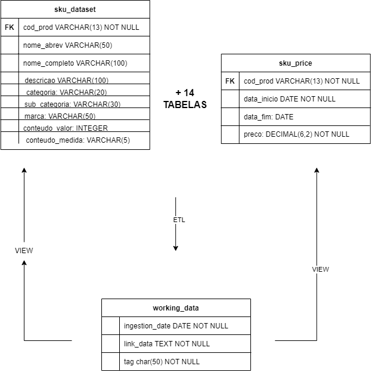

# Governança de Dados

### Índice
1. [Introdução](#1-introdução)
   - 1.1 [Contexto](#11-contexto)
   - 1.2 [Contexto do problema](#12-contexto-do-problema)
   - 1.3 [Escopo macro da solução](#13-escopo-macro-da-solução)
   - 1.4 [LGPD](#14-lgpd)
   
2. [Requisitos e User Stories](#2-requisitos-e-user-stories)

3. [Príncipios](#3-princípios)

4. [Definições, Acrônimos e Abreviações](#4-definições-acrônimos-e-abreviações)

5. [Estrutura organizacional](#5-estrutura-organizacional)
   - 4.1 [Comitê de governança de dados](#51-comitê-de-governança-de-dados)
   - 4.2 [Papéis e responsabilidades](#52-papéis-e-responsabilidades)

6. [Políticas de dados](#6-políticas-de-dados)
   - 6.1 [Classificação dos dados](#61-classificação-dos-dados)
   - 6.2 [Métrica de qualidade dos dados](#62-métricas-de-qualidade-dos-dados)
   - 6.3 [Definição e modelagem dos processos de qualidade](#63-definição-e-modelagem-dos-processos-de-qualidade)
   - 6.4 [Privacidade dos dados](#64-privacidade-dos-dados)
   - 6.5 [Níveis de acesso aos dados](#65-níveis-de-acesso-aos-dados)
   - 6.6 [Segurança dos dados](#66-segurança-dos-dados)

7. [Arquitetura](#7-arquitetura)
   - 7.1 [Visão geral da arquitetura](#71-visão-geral-da-arquitetura)
      - 7.1.2 [Consideração de arquitetura](#712-considerações-de-segurança)
      - 7.1.3 [Monitoramento e gerenciamento](#713-monitoramento-e-gerenciamento)
      - 7.1.4 [Integridade de dados](#714-integridade-dos-dados)
   - 7.2 [Arquitetura - Versão incrementada](#72-armazenamento-dos-dados)
   - 7.3 [Padrões e decisões arquiteturais](#73-padrões-e-decisões-arquiteturais)
   - 7.4 [Integração e interoperabilidade](#74-integração-e-interoperabilidade)

8. [Análise dos dados](#8-análise-dos-dados)
   - 8.1 [Métodos de segurança](#81-métodos-de-segurança)
   - 8.2 [Métricas de qualidade dos dados](#82-escalabilidade-e-desempenho)
   - 8.3 [Definição e modelagem dos processos de qualidade](#83-gestão-de-configuração-e-versionamento)
   - 8.4 [Privacidade dos dados](#84-auditoria-e-monitoramento-do-sistema)
   - 8.5 [Níveis de acesso aos dados](#85-interface-e-usabilidade)
   - 8.6 [Segurança dos dados](#86-manutenção-e-evolução)

9. [Processos de governança](#9-processos-de-governança)
   - 9.1 [Coleta de dados](#91-coleta-de-dados)
   - 9.2 [Armazenamento dos dados](#92-armazenamento-dos-dados)
   - 9.3 [Uso dos dados](#93-uso-dos-dados)
   - 9.4 [Compartilhamento dos dados](#94-compartilhamento-dos-dados)
   - 9.5 [Descarte dos dados](#95-descarte-dos-dados)
   - 9.6 [Treinamento e cultura de governança](#96-treinamento-e-cultura-de-governança)

10. [Revisão e melhoria contínua](#10-revisão-e-melhoria-contínua)
   - 10.1 [Processo de revisão](#101-processo-de-revisão)
   - 10.2 [Plano de melhoria](#102-plano-de-melhoria)

11. [Melhores Práticas de Código](#11-melhores-praticas-de-codigo)
   - 11.1 [Princípios DRY e SOLID](#111-principios-dry-e-solid)
   - 11.2 [Convenção PEP 8](#112-convencao-pep-8)
   - 11.3 [Controle de Versão](#112-controle-de-versao)

12. [Referências](#12-referências)
   - 12.1 [Documentos de referência](#121-documentos-de-referência)
   - 12.2 [Referências bibliográficas](#122-referências-bibliográficas)

### 1. Introdução
A criação de uma governança de dados visa estabelecer uma estrutura robusta para garantir a integridade, segurança e utilização eficaz dos dados dentro do projeto. Ela é fundamental para identificar oportunidades de negócios, otimizar processos e assegurar a conformidade regulatória, permitindo que a organização tome decisões informadas com base em dados confiáveis.

#### 1.1 Contexto 
O projeto apresentado pelo parceiro envolve dados que incluem informações sensíveis, como dados pessoais de funcionários e informações estratégicas relacionadas a vendas e projeções para o futuro. A gestão e proteção desses dados exigem uma abordagem cuidadosa e rigorosa, não apenas pela importância estratégica que eles representam para a empresa, mas também em cumprimento às exigências estabelecidas pela Lei Geral de Proteção de Dados.

### 1.2 Contexto do problema
A empresa parceira traz o caso de um cliente, CosmeticCo, uma grande varejista de cosméticos brasileira. A comunicação inadequada entre o setor corporativo da empresa e as lojas (incluindo gerentes e vendedores), especialmente em relação aos complexos modelos de remuneração variável, tem levado a um alto índice de rotatividade, baixo engajamento dos vendedores e desempenho inferior ao esperado. 

### 1.3 Escopo macro da solução
A solução irá abordar uma pipeline com políticas de governança de dados, sendo o resultado final um sistema que permita a visualização de informações hiper personalizadas dos dados dos vendedores e gerentes. 

#### 1.4 LGPD
A Lei Geral de Proteção de Dados (LGPD) surgiu em um contexto global de crescente preocupação com a privacidade e a segurança dos dados pessoais. O avanço da tecnologia, especialmente com o surgimento da Internet e das redes sociais, trouxe consigo a capacidade de coletar, armazenar e processar grandes volumes de dados sobre indivíduos. Isso gerou uma necessidade urgente de regulamentação para proteger os direitos dos cidadãos em relação ao uso de suas informações pessoais.

Uma das grandes influências da LGPD foi o Regulamento Geral sobre a Proteção de Dados (GDPR), uma legislação da União Europeia que entrou em vigor em maio de 2018. Foi o responsável por estabelecer um novo padrão global para a proteção de dados, impondo regras rigorosas para o tratamento de informações pessoais e aplicando multas para as organizações que violassem essas regras. A criação da LGPD foi, portanto, uma resposta do Brasil para alinhar-se a essas novas exigências globais, além de proteger a privacidade dos seus cidadãos em um contexto onde o mundo se torna mais conectado a cada dia.

### 2. Requisitos e User Stories
#### 2.1 Requisitos Funcionais

Requisitos funcionais descrevem o comportamento do sistema e as funcionalidades que o sistema deve ter para atender às necessidades dos usuários. Eles definem o que o sistema deve fazer para cumprir as expectativas dos usuários e são essenciais para o desenvolvimento de software. Dessa forma, 

**RF001 -** O pipeline deve realizar a limpeza e o processamento dos dados em um fluxo de ETL (Extract, Transform, Load) com camadas bem modularizadas

**RF002 -**  Os dados processados devem ser estruturados de forma a estarem prontos para consumo em funcionalidades específicas do data app

**RF003 -** Todos os dados pessoais devem ser criptografados durante o processamento e armazenamento

**RF004 -** O data app deve fornecer projeções de vendas e remuneração para vendedores e gerentes de loja no mês corrente

**RF005 -** O data app deve fornecer recomendações de produtos que são frequentemente vendidos juntos (cross-sell) e de produtos substitutos

**RF006 -** O data app deve permitir a comparação entre vendedores da mesma loja.

**RF007 -** O data app deve exibir uma estratégia de como apresentar os produtos com as maiores margens de lucro

**RF008 -** O data app deve ranquear as melhores lojas no mês corrente com base em métricas de desempenho

#### 2.2 Requisitos Não Funcionais

Requisitos não funcionais são os requisitos relacionados ao uso da aplicação em termos de desempenho, usabilidade, confiabilidade, segurança, disponibilidade, manutenibilidade e tecnologias envolvidas. Eles especificam as qualidades e restrições que o sistema deve possuir, definindo os atributos de qualidade do software

**RNF001 -** O pipeline de dados deve ser escalável, capaz de lidar com um volume crescente de dados sem degradação significativa do desempenho

**RNF002 -** O pipeline deve oferecer bom desempenho, garantindo que os dados sejam processados de maneira eficiente e dentro dos prazos necessários para a aplicação

**RNF003 -**  A criptografia de dados pessoais deve garantir a proteção das informações sensíveis, tanto em repouso quanto em trânsito

**RNF004 -**  As camadas do pipeline devem ser bem modularizadas, permitindo fácil manutenção, atualização e extensão do sistema

**RNF005 -** O data app deve ser compatível com plataformas mobile e web, garantindo uma experiência de usuário consistente em diferentes dispositivos.

#### 2.3 User Stories

User stories são descrições curtas que capturam as necessidades e desejos de um usuário final em um projeto de desenvolvimento de software. Elas servem como um lembrete do que deve ser feito, permitindo que os desenvolvedores compreendam claramente o que o usuário final espera obter com o produto ou funcionalidade. Além disso, elas ajudam a manter o foco no valor entregue ao usuário, facilitando a priorização das tarefas e o alinhamento com os objetivos do projeto.

1. Eu, **como usuário do sistema**, **quero** abrir o site e ter acesso direto à visualização dos dados, sem precisar passar por uma home page, para que eu possa acessar rapidamente as informações de que preciso;

2. Eu, **como usuário do sistema**, **quero** filtrar somente os dados que me interessam, para que eu tenha uma visualização clara e focada nas informações que são relevantes para mim;

3. Eu, **como gerente da loja**, **quero** visualizar no DataApp, monitorar e comparar o desempenho de cada funcionário,  para identificar oportunidades de melhoria e premiar os melhores desempenhos e, assim, tomar decisões para identificar oportunidades de melhoria e premiar os melhores desempenhos; 

4. Eu, **como gerente da loja**, **quero** visualizar o total de vendas de outras lojas da mesma região que a minha, para que eu possa entender se conseguirei receber um acréscimo de 2 mil reais no meu salário;

5. Eu, **como vendedor da loja**, não **quero** que outras pessoas acessem as informações sobre minhas vendas, para que minha privacidade seja garantida; 

6. Eu, **como vendedor da loja**, desejo verificar quanto falta para bater minha meta do mês, para que eu possa acompanhar  meu desempenho;

7. Eu, **como engenheiro de dados**, **quero** que o pipeline realize a limpeza e o processamento dos dados em um fluxo de ETL com camadas bem modularizadas, para que os dados sejam organizados de maneira eficiente e estejam prontos para uso em futuras análises;

8. Eu, **como analista de dados**, **quero** que os dados processados sejam estruturados e prontos para consumo no DataApp, para que eu possa facilmente gerar relatórios e análises específicas para vendedores e gerentes;

9. Eu, **como engenheiro de segurança**, **quero** que todos os dados pessoais sejam criptografados durante o processamento e armazenamento, para que as informações sensíveis dos vendedores e gerentes sejam protegidas;

10. Eu, **como vendedor**, **quero** receber recomendações de produtos que são frequentemente vendidos juntos ou que são substitutos, para que eu possa aumentar as minhas vendas por meio de cross-sell e upsell;

11. Eu, **como gerente de loja**, **quero** visualizar produtos com as maiores margens de lucro, para que eu possa maximizar o lucro da minha loja;

12. Eu, **como engenheiro de dados**, **quero** que o pipeline de dados seja escalável, para que ele possa lidar com um volume crescente de dados sem degradação significativa do desempenho;

13. Eu, **como engenheiro de software**, **quero** que o DataApp seja compatível com plataformas mobile e web, para que os usuários possam acessar as informações em diferentes dispositivos com uma experiência consistente;

14. Eu, **como diretor de operações**, **quero** visualizar um dashboard com insights de vendas e performance de todas as lojas, para que eu possa tomar decisões estratégicas baseadas em dados.

### 3. Princípios
A governança de dados na CosmeticCo será regida por uma série de princípios fundamentais, cada um com práticas específicas para enfrentar os desafios identificados na comunicação entre o setor corporativo e as lojas. A transparência será alcançada através da criação de um pipeline de dados que documenta e monitora cada etapa do ciclo de vida das informações, desde a coleta até a visualização. Isso garantirá que gerentes e vendedores tenham acesso a informações claras e precisas e, consequentemente, aumentando seu desempenho.

A responsabilidade será assegurada pela definição clara de papéis no processo de governança para todos os alunos desenvolvedores do projeto, onde cada parte, tem o dever e pontos de contato definidos, facilitando a comunicação e resolução de problemas. A integridade dos dados será mantida por meio do processo de ETL, com mecanismos de validação que garantem que os dados sobre os gestores e vendedores estejam consistentes.

A confidencialidade dos dados, especialmente informações sensíveis sobre remuneração e desempenho, será protegida com o uso de políticas de acesso restrito e criptografia. Cada nível de usuário terá apenas acesso aos dados em que é autorizado, o que fortalecerá a confiança entre gerentes e vendedores ao lidar com informações pessoais e de negócios. Finalmente, o compliance será garantido pela aderência a leis e regulamentos, como a LGPD.

### 4. Definições, Acrônimos e Abreviações
**GDPR:** General Data Protection Regulation, regulamento europeu de proteção de dados.
**LGPD:** Lei Geral de Proteção de Dados, legislação brasileira sobre privacidade e proteção de dados pessoais.
**Data Lake:** Armazenamento centralizado que permite armazenar dados estruturados e não estruturados em grande volume.
**DGC:** Data Governance Committee ou Comitê de Governança de Dados, grupo responsável pela supervisão da governança de dados na organização.
**ETL:** Extract, transform, load ou extrair, transformar e carregar.

### 5. Estrutura organizacional
#### 5.1 Comitê de governança de dados
Normalmente, em organizações, há um Comitê de Governança de Dados (DGC) que é composto por representantes das principais áreas de negócio, TI, jurídico e compliance. O comitê é responsável por revisar e aprovar políticas de dados, monitorar a conformidade e assegurar a implementação das melhores práticas de governança. Neste projeto, o comitê se dará pelos 7 (sete) integrantes do grupo Vizion.

#### 5.2 Papéis e responsabilidades
Os principais papéis de uma estrutura organizacional de governança de dados são o Data Owner, que é responsável pelos dados dentro de uma área específica da organização, o Data Steward que é responsável por garantir a qualidade e conformidade dos dados, o Data Custodian, responsável pelo armazenamento e proteção técnica dos dados e os datas users, que são os profissionais que utilizam os dados para tomar decisões e executar tarefas operacionais. No contexto deste projeto, em um ambiente acadêmico, os integrantes do grupo rotacionarão os papéis descritos.

### 6. Políticas de dados
#### 6.1 Classificação dos dados
Os dados serão classificados em categorias com base em sua sensibilidade e importância para a organização: internos para diretoria, internos para vendedores, internos para gerentes, confidenciais e críticos.

#### 6.2 Métricas de qualidade dos dados
1. **Completude dos dados**:
    - **Descrição**: avalia se todos os campos obrigatórios estão preenchidos.
    - **Métrica**: percentual de registros com todos os campos obrigatórios preenchidos.
    - **Fórmula**: (Número de registros completos / Número total de registros) * 100%.
        - Número de registros completos: refere-se ao número de registros que possuem todos os campos obrigatórios preenchidos
        - Número total de registros: refere-se ao número de registros total, incluindo os que faltam informações nos campos.
        - **Obtenção do número de registros completos**: verificação de cada registro para garantir que todos os campos obrigatórios estejam preenchidos (sem valores nulos ou vazios) e contagem de quantos registros estão completos.
2. **Consistência dos dados**:
    - **Descrição**: mede se os dados são consistentes entre diferentes bases de dados ou de uma mesma base.
    - **Métrica**: percentual de registros quão mantêm a solidez entre fontes de dados.
    - **Fórmula**: (Número de registros consistentes / Número integral de registros) * 100%
        - Número de registros consistentes: refere-se ao número de registros que mantêm consistência entre diferentes bases de dados ou dentro de uma mesma base. Por exemplo, se um vendedor aparece com diferentes IDs em uma tabela RAW e uma mais tratada, existe consistência entre os dados.
        - **Obtenção do número de registros consistentes:** comparação dos registros entre diferentes tabelas ou dentro de uma mesma tabela e identificação de divergências.
3. **Validade dos dados**:
    - **Descrição**: verifica se os dados seguem regras de negócios definidas (por exemplo, forma de data, princípios permitidos).
    - **Métrica**: percentual de registros quão estão conforme com as regras de validação.
    - **Fórmula**: (Número de registros válidos / Número integral de registros) * 100%.
        - Número de registros válidos: refere-se ao número de registros que estão em conformidade com as regras de validação de dados, como formato correto de data, valores dentro de intervalos esperados, etc.
        - Exemplo: formatação e padronização de datas, nomes de colunas de mesmo significado em diferentes tabelas, valores numéricos dentro de limites, etc.
        - **Obtenção no número de registros válidos:** Regras de validação nos campos relevantes (ex: datas, valores numéricos) e contagem de quantos registros passam em todas as validações.
4. **Integridade dos dados**:
    - **Descrição**: avalia se as correspondências entre os dados estão intactas e corretas.
    - **Métrica**: percentual de correspondência corretamente mantidas.
    - **Fórmula**: (Número de corespondências íntegras / Número integral de respondência) * 100%.
        - Refere-se ao número de registros onde as relações de integridade referencial estão corretas.
        - Por exemplo, se você tem uma tabela de vendas que faz referência a uma tabela de produtos, cada registro de venda deve corresponder a um produto existente na tabela de produtos.
        - **Obtenção do número de correspondências íntegras:** pode ser obtida se todas as chaves estrangeiras nas tabelas possuem correspondência válida na tabela referenciada, contando a quantidade de correspondências íntegras(com relação válida).
5. **Auditabilidade dos dados**:
    - **Descrição**: verifica se os dados possuem rastreabilidade, permitindo a ouvidoria de mudanças e operações realizadas.
    - **Métrica**: percentual de dados com histórico de alterações disponível.
    - **Fórmula**: (Número de registros auditáveis / Número integral de registros) * 100%.
        - Refere-se ao número de registros que têm rastreabilidade de alterações, permitindo que você veja quem alterou o registro, quando e o que foi alterado.
        - **Obtenção de número de registros auditáveis:** contagem do número de registros que possuem logs de alteração ou histórico de versão que permita a auditoria, ou seja, com uma tabela de logs ou uma coluna de "última modificação por", é possível usar essas informações para determinar a auditabilidade.

#### 6.3 Definição e modelagem dos processos de qualidade
1. **Completude dos dados**
- **Definição do processo**: criação de verificações automáticas que assegurem que todos os campos obrigatórios estejam preenchidos. Isso pode ser feito utilizando scripts que varrem a base de dados para identificar registros incompletos.
- **Modelagem**: implementar regras de negócio que validem a completude durante a inserção ou atualização dos dados. Relatórios periódicos de dados incompletos podem ser gerados para ação corretiva.

2. **Consistência dos dados**
- **Definição do processo**: implementação de checks que garantem que os dados são consistentes tanto dentro de uma base de dados quanto entre diferentes bases.
- **Modelagem**: uso de mecanismos de sincronização de dados e verificações cruzadas entre bases de dados para garantir consistência. Regras de normalização podem ser aplicadas para evitar redundâncias e inconsistências.

3. **Validade dos dados**
- **Definição do processo**: aplicação de regras de validação que asseguram que os dados seguem os padrões estabelecidos (ex.: formato de datas, valores dentro de intervalos permitidos).
- **Modelagem**: criação de scripts que validam os dados na inserção, atualização e em intervalos regulares. Os dados que não atenderem às regras de validação são sinalizados para revisão ou correção.

4. **Integridade dos dados**
- **Definição do processo**: verificações de integridade referencial entre tabelas para garantir que as chaves estrangeiras estão corretamente associadas.
- **Modelagem**: implementação de restrições de integridade no banco de dados e processos de validação que identificam e corrigem problemas de integridade, como registros órfãos.

5. **Auditabilidade dos dados**
- **Definição do processo**: implementação de logs de alteração que registram quem, quando e o que foi alterado em cada registro.
- **Modelagem**: configuração de sistemas de auditoria, como tabelas de logs ou versionamento de dados, que permitem rastrear todas as alterações realizadas nos registros ao longo do tempo.

#### 6.4 Privacidade dos dados
A privacidade dos dados pessoais será protegida em conformidade com as leis de privacidade aplicáveis, como a LGPD. Coletaremos e manteremos apenas os dados necessários, e, sempre que possível, os dados pessoais serão anonimizados e criptografados para proteger a identidade dos indivíduos. O consentimento para o uso dos dados será gerenciado de forma clara e transparente, permitindo que os titulares saibam como seus dados serão utilizados.

#### 6.5 Níveis de acesso aos dados
O acesso aos dados sensíveis será controlado através de uma classificação dos dados por nível de sensibilidade, com políticas de acesso adequadas para cada nível. A hierarquia de acesso será estabelecida com base na necessidade de conhecimento, garantindo que apenas níveis autorizados tenham acesso às informações mais sensíveis.

#### 6.6 Segurança dos dados
A segurança dos dados será garantida por meio de controles de acesso, onde o acesso aos dados será restrito de acordo com as funções e responsabilidades dos colaboradores. Além disso, os dados estarão hospedados em um ambiente privado da cloud escolhida pelo grupo.

### 7. Arquitetura

#### 7.1 Visão geral da arquitetura
 
Uma visão geral da arquitetura serve para fornecer uma compreensão clara e simplificada de como os diferentes componentes de um sistema ou projeto se conectam e interagem entre si. Ela ajuda a identificar o fluxo de dados, os principais processos envolvidos, os pontos de integração entre sistemas e as tecnologias utilizadas. Nesse sentido, abaixo, apresento uma versão (que pode sofrer alterações) da arquitetura de dados e informação do nosso projeto.

.png)

<a href="https://drive.google.com/file/d/10JP9oNgObCI3W-n3-55B0GlqU0SdTODs/view?usp=sharing">Link para o Draw.io </a>

##### Elementos da arquitetura

- Amazon S3 (Camada bronze): Armazenamento inicial dos dados brutos. Aqui, os dados são armazenados sem transformação, representando a "Camada Bronze" do pipeline de dados.

- Python (Processamento e transformação): Os dados brutos do S3 são extraídos e transformados por scripts Python, que fazem parte do processo ETL (Extração, Transformação e Carga). Esta etapa representa o movimento dos dados da camada Bronze para a "Camada Silver".

- ClickHouse (Armazenamento e procedures): O ClickHouse é utilizado como um banco de dados de alto desempenho para armazenamento e processamento de dados transformados. Os dados chegam à "Camada Silver" e são organizados em tabelas intermediárias.
Procedures e Views SQL: No ClickHouse, são criadas views para consultas rápidas e eficientes, oferecendo dados prontos para análise. Esta etapa corresponde à "Camada Gold".

Streamlit (Dashboard): Um aplicativo de dashboard construído com Streamlit para visualizar os dados de maneira interativa e amigável. Ele consome os dados diretamente das views SQL no ClickHouse.

- Amazon CloudWatch (Monitoramento): Monitoramento de logs e métricas do ClickHouse na Amazon EC2, o que ajuda a garantir a operação estável e eficiente do pipeline.

##### Relacionamento e descrição de cada elemento da arquitetura

A. Amazon S3

O Amazon S3 é utilizado como o repositório inicial de dados brutos, conhecido como a "Camada Bronze" no pipeline de dados. Neste estágio, todos os dados coletados de diversas fontes são armazenados de forma íntegra e sem qualquer tipo de transformação ou processamento.

A utilização do S3 oferece uma solução escalável e segura para armazenamento de dados, permitindo que grandes volumes de informações sejam mantidos de maneira eficiente. Além disso, o S3 suporta diversos formatos de arquivos (como CSV, JSON, Parquet), oferecendo flexibilidade na ingestão de dados. Os scripts Python são responsáveis por acessar esses dados diretamente do S3 para iniciar o processo de ETL (Extração, Transformação e Carga).

B. Python

Os scripts Python atuam na execução do processo de ETL, transformando dados brutos da "Camada Bronze" em informações mais estruturadas para análise na "Camada Silver". Eles realizam as seguintes etapas:

- Extração (E): Os scripts conectam-se ao Amazon S3 para ler e baixar os dados brutos necessários. Utilizam bibliotecas como boto3 para interagir com o S3, garantindo uma transferência de dados segura e eficiente.

- Transformação (T): Os dados extraídos são processados e transformados utilizando bibliotecas como Pandas e PyArrow. Durante esta fase, os dados são limpos, normalizados e formatados conforme necessário. Por exemplo, arquivos CSV são convertidos em formatos Parquet mais otimizados para análises posteriores.

- Carga (L): Após a transformação, os dados são carregados no ClickHouse, um banco de dados de alta performance, para armazenamento e consultas rápidas. Esse processo garante que os dados estejam preparados para consultas eficientes e análises avançadas.

C. ClickHouse

O ClickHouse é utilizado como a principal solução de armazenamento de dados processados na arquitetura, representando a "Camada Silver". Ele foi escolhido por ser um sistema de gerenciamento de banco de dados colunar altamente otimizado para consultas analíticas e operações de leitura intensiva, oferecendo excelente desempenho em grandes volumes de dados.

Armazenamento de dados processados: Os dados transformados são armazenados em tabelas do ClickHouse, como a `working_data`. Essa tabela contém colunas essenciais como `ingestion_date` (data de ingestão dos dados), `line_data` (dados em formato JSON) e `tag` (indicador de tipo de dado).

Criação de views: A partir dessas tabelas, são criadas views, como `cost_view` e `price_view`, para facilitar as consultas de dados específicos (como custos e preços de produtos). As views permitem uma recuperação rápida de informações otimizadas, mantendo a flexibilidade para filtrar e organizar os dados de acordo com a necessidade do negócio.

D. Streamlit

O Streamlit é a interface de visualização dos dados processados, proporcionando uma plataforma interativa para explorar e analisar dados de maneira intuitiva. Ele utiliza dados provenientes diretamente das views SQL no ClickHouse e apresenta esses dados de forma amigável para o usuário, através de dashboards.

Painéis interativos: Os dashboards são construídos para permitir que usuários filtrem, analisem e visualizem dados de maneira interativa. Eles utilizam funcionalidades como gráficos de linha para mostrar a evolução de custos e preços ao longo do tempo, e tabelas dinâmicas para exibir dados filtrados conforme a necessidade do usuário.

Exploração intuitiva de dados: Streamlit permite uma análise visual fácil e direta, ajudando os usuários a descobrir padrões, tendências, e insights sem a necessidade de habilidades avançadas de análise de dados

E. Amazon CloudWatch

O Amazon CloudWatch será utilizado para monitorar o desempenho e a saúde do ClickHouse hospedado em uma instância EC2. Embora ainda não esteja implementado, o CloudWatch oferece diversos benefícios cruciais para o monitoramento e gerenciamento de operações:

Monitoramento de recursos: CloudWatch monitorará métricas importantes do ClickHouse, como uso de CPU, memória, latência de consultas e operações de leitura/gravação. Esse monitoramento contínuo ajuda a garantir que o sistema funcione de maneira otimizada e evita gargalos de desempenho.

Análise de logs: Os logs do ClickHouse, incluindo informações sobre falhas de consulta, tempo de execução, e erros, serão enviados ao CloudWatch para análise, o que facilitará a identificação de problemas, permitindo correções rápidas e eficazes.

Alertas e notificações: CloudWatch permite configurar alarmes que notificam a equipe responsável sempre que uma métrica excede um limite pré-definido (ex. uso excessivo de CPU ou falhas repetidas de consultas), fazendo com que a equipe esteja ciente de problemas em tempo real e possa agir proativamente para mitigar riscos.

#### 7.1.2 Considerações de segurança

##### Pontos identificados

###### Segurança dos dados em trânsito:

Para garantir a proteção dos dados durante a transferência entre diferentes componentes da arquitetura (como Amazon S3, ClickHouse e Streamlit), é essencial usar HTTPS para criptografar todos os dados trafegando na rede. Isso impede que os dados sejam interceptados ou modificados por terceiros mal-intencionados durante o transporte, garantindo sua confidencialidade e integridade. O uso de HTTPS (HTTP sobre TLS/SSL) protege tanto as requisições quanto as respostas entre o cliente e o servidor, evitando ataques como o "Man-in-the-Middle" (MitM). Além disso, ao configurar o acesso a serviços como o S3 e a instância EC2 do ClickHouse, é necessário garantir que todas as chamadas API e transferências de dados utilizem endereços HTTPS.

###### Segurança de acesso ao ClickHouse:

No ClickHouse, a segurança de acesso é gerenciada por meio de um arquivo de configuração (`clickhouse-users.xml`). Este arquivo permite definir usuários, senhas e permissões específicas, garantindo que apenas indivíduos autorizados possam acessar, consultar ou modificar os dados armazenados. Por exemplo, podemos definir usuários com diferentes níveis de acesso: alguns podem apenas ler dados, enquanto outros podem executar queries complexas ou modificar a estrutura do banco de dados. A configuração adequada dos usuários e de suas permissões evita acessos não autorizados e minimiza os riscos de violações de segurança.

######  Credenciais seguras:

O uso do arquivo .env (gerenciado pela biblioteca `dotenv`) para armazenar credenciais sensíveis, como chaves de acesso AWS, senhas de banco de dados, e tokens de autenticação, é uma prática essencial para proteger informações confidenciais e evita a exposição de credenciais diretamente no código-fonte, que pode ser inadvertidamente compartilhado ou armazenado em repositórios públicos. O `.env` deve ser armazenado de forma segura e jamais incluído no controle de versão (ex.: Git). , que já é uma prática que estamos utilizando. As credenciais são carregadas dinamicamente apenas durante o tempo de execução do ambiente seguro.

##### Considerações estratégicas

###### Criptografia

Criptografia de dados em trânsito e em repouso: Implementar SSL/TLS para todas as comunicações entre componentes do sistema (Amazon S3, ClickHouse, Streamlit) para garantir que os dados estejam sempre protegidos durante o transporte. Além disso, é importante considerar a criptografia de dados "em repouso", especialmente para os dados armazenados no S3 e no ClickHouse, o que pode ser feito usando chaves de criptografia gerenciadas pela AWS (para S3) ou chaves de criptografia personalizadas, dependendo do nível de segurança exigido.

###### Controle de acesso

Políticas de controle de acesso baseadas em função (RBAC): Implementar um modelo de controle de acesso baseado em funções (RBAC) que limita o acesso aos recursos de dados com base na função do usuário. Por exemplo, usuários administrativos podem ter permissão para gerenciar configurações de segurança, enquanto os analistas de dados podem apenas ler dados e executar consultas. Esse modelo de controle de acesso deve ser aplicado em todos os níveis da arquitetura, incluindo o acesso aos dados no ClickHouse e ao código-fonte dos scripts Python.

Segurança de infraestrutura: Garantir que a infraestrutura, como a instância EC2 onde o ClickHouse está hospedado, tenha regras de firewall adequadas, restringindo o acesso somente a IPs autorizados e portas necessárias. Utilizar Grupos de segurança da AWS para definir essas políticas de acesso de forma rígida e monitorada.

#### Planos de ação

##### Revisão regular de segurança:

Auditorias periódicas de segurança: Realizar auditorias regulares para revisar as permissões de usuários, configurações de segurança, criptografia e práticas de armazenamento de credenciais. Essas auditorias devem incluir a análise de logs de acesso, revisão de políticas de controle de acesso, verificação de conformidade com padrões de segurança e atualização de credenciais regularmente. Um cronograma de auditoria trimestral ou semestral deve ser implementado, garantindo que a equipe de segurança revise todos os componentes críticos da arquitetura.

Teste de vulnerabilidade e penetração: Executar testes de penetração e varredura de vulnerabilidades periodicamente para identificar fraquezas na arquitetura de segurança e tomar medidas corretivas proativas antes que uma exploração maliciosa ocorra.

##### Monitoramento ativo

Monitoramento com Amazon CloudWatch: Utilizar esse serviço da AWS para configurar métricas e alarmes de segurança, como falhas de autenticação repetidas, picos anômalos de uso de recursos, e acessos não autorizados. Configurar alarmes específicos para atividades suspeitas ou anômalas, como tentativas de acesso de locais desconhecidos ou fora do horário de expediente. Além disso, configurar notificações automáticas para a equipe de segurança quando esses alarmes forem acionados, permitindo uma resposta rápida e coordenada a possíveis ameaças.

#### 7.1.3 Monitoramento e gerenciamento

##### Monitoramento de desempenho no ClickHouse

O Amazon CloudWatch será usado para monitorar métricas críticas de desempenho do ClickHouse hospedado na instância EC2. Abaixo, se encontram algumas métricas que podem vir a ser utilizadas:

- Uso de CPU: Monitorar o percentual de utilização da CPU para identificar se o servidor está sobrecarregado ou subutilizado. Picos inesperados de uso de CPU podem indicar processos não otimizados, consultas demoradas ou ataques de negação de serviço (DDoS).

- Uso de Memória: Acompanhar o consumo de memória para garantir que o ClickHouse tenha memória suficiente para operar eficientemente. O monitoramento do uso de memória identifica vazamentos de memória ou a necessidade de ajustar a alocação de recursos, evitando situações de "Out of Memory" (OOM) que poderiam levar o sistema a falhar.

- Latência de consultas: Medir o tempo de execução das consultas no ClickHouse. Latências elevadas ou crescentes podem sinalizar problemas de desempenho, como falta de índices adequados, carga excessiva no servidor ou consultas mal otimizadas. Dessa forma, monitoramento da latência garante que os tempos de resposta permaneçam dentro dos limites aceitáveis para proporcionar uma boa experiência ao usuário.

##### Monitoramento de logs:

A coleta de logs do ClickHouse serve para análise de erros, auditoria de segurança e conformidade, o que inclui:

Logs de erro: Coleta e análise de logs de erro para identificar falhas de consultas, problemas de configuração ou quaisquer outras exceções não tratadas. Logs de erro frequentes podem indicar falhas repetidas, sugerindo a necessidade de otimização ou correções no código SQL ou na configuração do banco de dados.

Logs de acesso e auditoria: Monitorar logs de acesso para rastrear quem acessou o banco de dados, quando e quais operações foram realizadas. Essas ações sãu usadas para fins de auditoria, conformidade regulatória e detecção de atividades suspeitas ou não autorizadas.

Logs de performance: Registrar informações sobre consultas executadas, como tempo de execução, planos de execução de queries e recursos utilizado ajuda a identificar consultas que precisam ser otimizadas ou operações que consomem muitos recursos.

#### 7.1.4 Integridade dos dados 

##### Controle de Qualidade de Dados no ETL:

Validações de qualidade durante o ETL: Durante o processo de ETL (Extração, Transformação e Carga), é fundamental implementar verificações rigorosas de qualidade de dados em cada etapa para garantir que dados inválidos, incompletos ou inconsistentes sejam identificados, corrigidos ou descartados antes de serem carregados na camada de armazenamento analítico (ClickHouse).

Verificação de tipos de dados: Garantir que todos os dados extraídos atendam aos tipos esperados (por exemplo, números, datas, strings). Se um campo de preço for preenchido com texto em vez de um valor numérico, ele deve ser sinalizado como um erro.

Verificação de valores obrigatórios: Verificar se todos os campos obrigatórios (como IDs de produtos, datas de transação, etc.) estão preenchidos. Registros que possuam campos obrigatórios vazios devem ser sinalizados para correção ou exclusão.

Validação de domínio de dados: Checar se os valores dos dados estão dentro de um intervalo aceitável ou se pertencem a um conjunto de valores permitidos (ex.: verificar se os preços estão dentro de um intervalo esperado, se as datas de transação são válidas e não estão no futuro, etc.).

Remoção de duplicatas: Implementar lógica para identificar e remover dados duplicados, garantindo que cada registro seja único e não cause inconsistências nas análises. Isso pode ser feito usando funções de hashing ou verificações de chave primária.

Detecção de anomalias: Utilizar técnicas de detecção de anomalias para identificar padrões fora do comum, como picos de vendas inesperados ou valores de custo negativos, que podem indicar erros nos dados.

##### Auditoria de dados

Manter logs detalhados de transformações e cargas: Manter um sistema de auditoria robusto que registre todas as operações de transformação e carga de dados. Isso inclui:

Registro de operações de ETL: Cada execução de script de ETL deve ser registrada com detalhes, como o horário de início e término, quantidade de dados processados, fontes de dados utilizadas, e quaisquer erros ou advertências ocorridos durante o processo. Essas informações são vitais para identificar problemas no fluxo de dados e resolver discrepâncias.

Logs de alterações de dados: Criar logs que registrem todas as alterações feitas nos dados durante o processo de transformação, como dados que foram ajustados, campos que foram preenchidos automaticamente (por exemplo, com valores padrão), e registros que foram removidos devido a inconsistências. 

Rastreamento de dados no nível de registro: Manter uma trilha de auditoria para cada registro de dados, desde sua origem (Amazon S3) até sua inserção no ClickHouse, com informações sobre todas as transformações realizadas. 

##### Transformação e limpeza de dados:

Limpeza de dados: Utilizar scripts Python, com bibliotecas como Pandas e PyArrow, para realizar operações de limpeza, como:

Remoção de espaços em branco e caracteres especiais: Normalizar textos para eliminar espaços em branco no início e no final de strings, remover caracteres especiais não desejados e garantir que todos os dados estejam em um formato uniforme.

Correção de formatos de data e hora: Converter todos os campos de data e hora para um formato padrão (ex. ISO 8601) para garantir a consistência temporal dos dados.
Normalização de Valores Numéricos: Padronizar o formato de valores numéricos (ex. número de decimais) e corrigir discrepâncias como separadores de milhar ou decimal.

Transformação de dados: Implementar transformações que garantam que os dados estejam prontos para análise.

Categorização de dados: Agrupar dados em categorias específicas para simplificar as análises. Por exemplo, classificar produtos em categorias como "Alta Margem" ou "Baixa Margem" com base em seus preços e custos.

Criação de novas variáveis: Calcular novos campos derivados, como margens de lucro, taxa de crescimento, ou métricas de performance, para enriquecer a análise.

Consistência dos dados transformados: Garantir que após a transformação, os dados estejam consistentes com as expectativas definidas no esquema do ClickHouse (ex.: tipo de dados, valores obrigatórios), e que estejam prontos para serem carregados na camada de análise.

##### Modelo lógico de dados
Na primeira versão do modelo lógico, todas as tabelas iniciam com seus dados brutos (RAW). Após o processo de ETL, essas tabelas são consolidadas em uma única tabela contendo três colunas: uma para o timestamp, outra para os dados em formato JSON que agregam todas as informações das tabelas originais, e uma terceira coluna chamada 'tag', que identifica o nome de cada dataframe inicial.

#### 7.2 Arquitetura do sistema - Versão 2

<a href="https://drive.google.com/file/d/10JP9oNgObCI3W-n3-55B0GlqU0SdTODs/view?usp=sharing">Link para o Draw.io (segunda aba)</a>

Esta segunda versão da documentação visa proporcionar uma visão abrangente da arquitetura de dados, considerando o fluxo completo de coleta, processamento, armazenamento, visualização e monitoramento de dados. Além de detalhar cada componente da arquitetura, abrange-se aspectos relacionados à segurança, governança e escalabilidade, promovendo uma abordagem holística e colaborativa para o gerenciamento do sistema.

##### Elementos da arquitetura

1. Amazon S3 (Camada bronze):
O Amazon S3 é utilizado como o ponto de entrada para o armazenamento de dados brutos, representando a "Camada Bronze" do pipeline de dados. Todos os dados coletados de diferentes fontes são armazenados no S3 sem qualquer transformação inicial, mantendo sua integridade original. Essa camada oferece uma solução escalável e segura para armazenar grandes volumes de dados em diversos formatos (CSV, JSON, Parquet). O S3 também facilita a integração com outros serviços da AWS, como o AWS Lambda, que é acionado automaticamente quando novos dados são carregados.

2. AWS Lambda e scripts Python (Processamento e transformação):
A função AWS Lambda é implementada para orquestrar o início do processo de ETL (Extração, Transformação e Carga) assim que novos dados são carregados no S3. A Lambda executa scripts Python que utilizam bibliotecas como boto3 para ler dados do S3, e Pandas e PyArrow para transformar os dados. Esses scripts realizam as seguintes etapas:

   - Extração (E): Os dados brutos são extraídos do S3 e carregados na memória para processamento. Essa extração é feita de maneira eficiente e segura, garantindo que os dados sejam transferidos de forma íntegra.
   - Transformação (T): Durante esta fase, os dados são transformados em formatos otimizados, como Parquet, e passam por processos de limpeza, normalização e enriquecimento. Qualquer dado inválido ou inconsistente é filtrado e corrigido conforme necessário.
   - Carga (L): Após a transformação, os dados são carregados no banco de dados ClickHouse, representando a "Camada Silver", onde são armazenados de forma organizada e pronta para consultas analíticas.

3. ClickHouse (Armazenamento e procedures):
O ClickHouse serve como o principal repositório para dados processados, representando a "Camada Silver". É escolhido devido ao seu desempenho superior para consultas analíticas e operações de leitura em grande escala. Dentro do ClickHouse, os dados transformados são armazenados em tabelas intermediárias, como a `working_data`, que contém informações detalhadas sobre cada registro processado.

   Procedures SQL e views, como `cost_view` e `price_view`, são criadas para consultas rápidas e eficientes de dados específicos e ajudam a organizar os dados de maneira que estejam prontos para análise, fornecendo um acesso otimizado às informações conforme necessário para os relatórios e dashboards.

4. Elasticsearch e Kibana (Monitoramento):
Em vez de usar o Amazon CloudWatch, o sistema adota o Elasticsearch e o Kibana para monitoramento de logs e métricas. Logs de processamento, transformações de dados, execuções de scripts e consultas ao ClickHouse são enviados para o Elasticsearch. Kibana é utilizado para criar dashboards de monitoramento que ajudam a equipe a visualizar métricas em tempo real, identificar possíveis problemas e garantir a estabilidade da operação, abordagem que proporciona uma visão consolidada da performance do sistema, permitindo a detecção rápida de falhas e o ajuste proativo de recursos.

5. Streamlit (Dashboard):
O Streamlit é utilizado como uma interface de visualização interativa, consumindo dados diretamente das views SQL no ClickHouse. Ele fornece um dashboard intuitivo que permite aos usuários explorar e analisar os dados transformados. Os painéis são altamente interativos, permitindo filtragem dinâmica, visualização de gráficos e tabelas, facilitando a descoberta de insights e a tomada de decisões informadas (o que será muito relevanta para a persona do projeto).

##### Relacionamento e descrição dos componentes da arquitetura

A. Amazon S3:
O Amazon S3 armazena os dados brutos, servindo como ponto de entrada para o pipeline de dados. Os scripts Python, executados por meio de AWS Lambda, conectam-se ao S3 para extrair os dados necessários. O uso de eventos S3 permite uma integração fluida, acionando o Lambda assim que novos dados são carregados.

B. AWS Lambda e scripts Python:
O AWS Lambda gerencia o processamento de dados usando scripts Python, que são responsáveis pela execução do ETL. Ao conectar-se ao S3, o Lambda inicia a extração, transformação e carga dos dados para o ClickHouse. O uso de funções serverless reduz custos e facilita a escalabilidade.

C. ClickHouse:
Os dados processados são carregados no ClickHouse, onde são armazenados e organizados para análise. Views e procedures são configuradas para otimizar consultas e permitir acesso eficiente aos dados. O ClickHouse garante alta performance para consultas complexas, suportando operações de leitura intensiva.

D. Elasticsearch e Kibana:
O Elasticsearch coleta logs e métricas de todos os componentes do sistema, desde a execução de scripts Python até as operações no ClickHouse. Kibana oferece dashboards de monitoramento para visualização de logs, métricas de performance e análises de comportamento, ajudando a identificar problemas rapidamente.

E. Streamlit:
O Streamlit fornece uma interface de visualização fácil e intuitiva para os dados, permitindo que os usuários explorem e analisem as informações de forma interativa. A integração direta com as views SQL do ClickHouse traz uma experiência de usuário fluida e responsiva.

##### Visão geral da arquitetura em 3 camadas

1. **Camada de dados**

**Objetivo**: responsável por armazenar e recuperar dados do armazenamento em nuvem (AWS S3) e do Clickhouse para processamento e análise posterior.

**Componentes**:
- **Amazon S3**: para o armazenamento de dados brutos.
  - O arquivo `s3_client_service.py` lida com a interação com o AWS S3, incluindo a criação de buckets, upload/download de arquivos e listagem de arquivos.
  
- **ClickHouse**: para o armazenamento eficiente de dados processados e consultas analíticas de alta performance.
  - Os dados são armazenados e processados no Clickhouse. As views para consultas analíticas são definidas em scripts SQL, como o `create_view_margin.sql`.

2. **Camada de aplicação**

**Objetivo**: responsável por transformar dados brutos em informações processadas.

**Componentes**:
- **Python**: realiza o processamento e orquestração dos dados.
  - O arquivo `data_processing_service.py` lida com as transformações dos dados, incluindo a conversão dos dados para o formato parquet para armazenamento no Clickhouse.
  
- **Flask**: exposição dos pipelines de dados e serviços como endpoints REST.
  - O arquivo `pipeline_controller.py` define os endpoints para processar dados do S3 e recuperar resultados processados (ex: similaridade de produtos baseada na margem).

- **Monitoramento**: os logs são gerenciados pelo módulo `logging` do Python, para acompanhamento das tarefas de processamento.

3. **Camada de apresentação**
**Objetivo**: responsável por apresentar os dados processados para os usuários finais (interface).

**Componentes**:
- **Dashboard Streamlit**: os dados são visualizados por meio de serviços que se conectam às views SQL.
  - O projeto inclui código para buscar dados dos serviços Flask para visualizações em dashboards, como visto no arquivo `view_service.py`, que busca dados da API Flask e os transforma em um dataframe do pandas para uso posterior.

##### Considerações de segurança e governança

1. Segurança dos dados em trânsito e em repouso:
Para proteger os dados durante o transporte e o armazenamento, todas as comunicações entre componentes (Amazon S3, AWS Lambda, ClickHouse e Streamlit) são criptografadas usando TLS/SSL. A criptografia em repouso também é aplicada para os dados armazenados no S3 e no ClickHouse, utilizando chaves gerenciadas pela AWS ou chaves personalizadas conforme a política de segurança da organização.

2. Controle de acesso:
A arquitetura utiliza um modelo de Controle de Acesso Baseado em Função (RBAC), definindo diferentes níveis de permissões para usuários. No ClickHouse, a segurança de acesso é gerenciada pelo arquivo `clickhouse-users.xml`, onde usuários e permissões são configurados para restringir o acesso apenas a indivíduos autorizados. Isso ajuda a mitigar riscos de acesso não autorizado e violação de dados.

3. Monitoramento e auditoria:
Logs de acesso e operações são armazenados no Elasticsearch para auditoria e conformidade. O uso de Kibana faz a visualização e análise desses logs, facilitando a detecção de atividades suspeitas ou não autorizadas.

##### Considerações estratégicas para governança e escalabilidade

A versão 2 reflete uma abordagem estratégica que prioriza a governança de dados, segurança e escalabilidade. Com a infraestrutura baseada em serviços escaláveis como S3, AWS Lambda e ClickHouse, o sistema está preparado para lidar com aumentos de volume de dados e usuários. O uso do Elasticsearch e Kibana para monitoramento e log centralizados facilita a detecção de problemas e a gestão de desempenho, garantindo um ambiente seguro e eficiente.

#### Futuras melhorias voltadas para governança, segurança e escalabilidade

Para fortalecer ainda mais a arquitetura do sistema e garantir que ela não apenas atenda às necessidades atuais, mas também esteja preparada para o crescimento futuro, precisa-se considerar aprimoramentos em governança, segurança e escalabilidade. Abaixo, seguem recomendações detalhadas que foram pensadas pelo grupo para cada uma dessas áreas, com um nível de abstração baixo, focando em ações práticas que podem ser implementadas a curto e médio prazo.

1. Governança de dados:

Políticas de retenção e ciclo de vida dos dados: Estabelecer políticas claras de retenção de dados que definam por quanto tempo diferentes tipos de dados devem ser armazenados antes de serem arquivados ou excluídos. Isso deve incluir a categorização de dados com base em sua sensibilidade e relevância, como dados transacionais, dados de logs de auditoria e dados de usuários. Implementar automações que utilizem scripts dr manutenção periódica no ClickHouse para excluir dados desnecessários ou migrá-los para armazenamentos mais econômicos, como o Amazon S3.

Processos de decisão de governança: Criar um comitê de governança de dados que inclua stakeholders de diferentes áreas (equipe técnica, compliance, segurança, e gerência de produto). Definir processos formais para a tomada de decisão sobre padrões de dados, nomenclatura, formatos e práticas de arquivamento. Estabelecer reuniões mensais ou trimestrais para revisar as práticas de governança, discutir incidentes e garantir a conformidade contínua com as políticas.

2. Segurança:

Plano de resposta a incidentes de segurança: Elaborar um plano de resposta a incidentes de segurança que inclua procedimentos detalhados para identificar, responder e mitigar ameaças. Definir uma equipe de resposta a incidentes (IRT - Incident Response Team) e estabelecer papéis e responsabilidades claros para cada membro. Criar um guia de ações imediatas, como isolar instâncias comprometidas, analisar logs de eventos do Elastic Search e notificar os stakeholders relevantes. Incluir também uma lista de verificação de pós-incidente para garantir que todas as etapas de remediação e documentação sejam concluídas.

Auditorias de segurança e conformidade: Realizar auditorias regulares de segurança com um plano de auditoria detalhado. Essas auditorias devem incluir a revisão das permissões de usuários, análise de logs de acesso, verificação de conformidade com padrões de segurança (ex.: GDPR, LGPD) e validação da configuração segura de todos os serviços, como o ClickHouse e o Elasticsearch.

3. Escalabilidade:

Estratégias de crescimento horizontal e vertical: Planejar a escalabilidade da infraestrutura com base no crescimento esperado de volume de dados e número de usuários. Implementar estratégias de escalabilidade horizontal, como a adição de novas instâncias EC2 para o ClickHouse e o ElasticSearch conforme a demanda aumenta. Considerar também a escalabilidade vertical, ajustando o tamanho e a capacidade das instâncias para melhorar o desempenho. Automatizar esses ajustes com o uso de Auto Scaling Groups e políticas de escalabilidade baseadas em métricas de uso (CPU, memória, latência de consultas).

Monitoramento contínuo de desempenho e otimização: Implementar um sistema de monitoramento contínuo que utilize o ElasticSearch e o Kibana para rastrear métricas-chave de desempenho (como latência de consulta, uso de CPU/memória, etc.) e disparar alertas automáticos quando certos limiares forem atingidos. Baseado nos dados de monitoramento, ajustar a arquitetura para otimizar o desempenho, como adicionar índices no ClickHouse, particionar tabelas grandes ou otimizar consultas SQL complexas.

Planos de escalabilidade futuros: Desenvolver um roadmap de escalabilidade que inclua planos para adoção de novas tecnologias, otimizações de infraestrutura e estratégias de balanceamento de carga para suportar o crescimento do sistema. Realizar testes de carga regulares para simular cenários de alto tráfego e ajustar a arquitetura conforme necessário. Definir pontos de decisão claros para expandir recursos ou adotar novos serviços conforme a demanda cresce.

#### 7.3 Padrões e decisões arquiteturais
_!!!! descrição dos padrões de design adotados (ex: MVC, Microserviços) e decisões-chave que impactam a arquitetura_

#### 7.4 Integração e interoperabilidade
_!!!! detalhar como o sistema se integra com outros sistemas e componentes_

### 8. Análise dos dados
_!!!! trazer aqui todo o processo que fizemos de análise exploratória, as features geradas, descrição das tabelas e dados analisados.._

#### 8.1 Medição da qualidade dos dados  
_!!!! definição e modelagem dos processos de qualidade, e definição das métricas de qualidade_

#### 8.2 Métodos de segurança
_!!!! descrição as abordagens de segurança implementadas para proteção do sistema e dos dados_

#### 8.3 Escalabilidade e desempenho
_!!!! aprofundar nas estratégias de escalabilidade baseado na arquitetura_

#### 8.4 Gestão de configuração e versionamento
_!!!! descrever os métodos e as ferramentas utilizados para o controle de versão e gerenciamento de configuração do sistema (igual ao módulo passado talvez)_

#### 8.5 Auditoria e monitoramento do sistema
_!!!! mecanismos para auditoria das operações e monitoramento contínuo do sistema para garantir conformidade e desempenho, SE BASEAR NO TOGAF_

#### 8.6 Interface e usabilidade
Um primeiro protótipo da interface foi desenvolvido no Figma contemplando as features propostas e as user stories estabelecidas. Baseado no tempo e recursos disponíveis para desenvolvimento do projeto, o time optou por usar o Streamlit, uma ferramenta que facilita do desenvolvimeno de interfaces para DataApps, como mencionado anteriormente no documento.
O protótipo e outras documentações do seu funcionamento podem ser encontrados no [projeto do Figma](https://www.figma.com/design/RpNuZTOI9lBQp82drcZFv1/Interface-Vizion---M11?node-id=102-432&t=AoXDBrZmo0VvxwaW-1). Você também pode navegar pelo protótipo executando o comando _Ctrl + Alt + Enter_. 

Alguns ajustes já foram mapeados para a próxima sprint baseado nos apontamentos levantados pelo parceiro durante a review. Alguns deles são: 
- Remover informação de salario base dos vendedores da visualização do gerente;
- Segmentar entre remuneração e meta para ficar mais claro pro usuario quanto falta para atingir a meta;
- Trabalhar melhor o gráfico de colunas empilhadas na visão do gerente. 
- Aprimorar proposta para a user stories 2, trazendo mais opções de filtros que possam ser relevantes para cada persona.
- Aprimorar proposta para a user stories 4, trazendo valores de vendas das lojas da mesma região, além do ranking já existente. 
- Estudar proposta para user stories 13 em termos de responsividade (Eu, como engenheiro de software, quero que o DataApp seja compatível com plataformas mobile e web, para que os usuários possam acessar as informações em diferentes dispositivos com uma experiência consistente"). O Streamlit já ofecere uma responsividade nativa, mas é necessário refletir sobre a performance dos gráficos em dispositivos móveis e quais gráficos seriam os ideais para esses dispositivos. 
- Trazer proposta de visualização para o diretor de operações, seguindo a user stories 14 - "Eu, como diretor de operações, quero visualizar um dashboard com insights de vendas e performance de todas as lojas, para que eu possa tomar decisões estratégicas baseadas em dados."

#### 8.7 Manutenção e evolução
_!!!! trazer um planejamento para a manutenção contínua e evolução da aplicação ao longo do tempo, e sugestões de futuras implementações_

### 9. Processos de Governança
#### 9.1 Coleta de Dados
A coleta de dados será feita de maneira ética e em conformidade com as leis. Serão definidos procedimentos para garantir que os dados sejam coletados de forma transparente, com consentimento adequado e de maneira a minimizar a coleta de dados desnecessários.

#### 9.2 Armazenamento dos Dados
Os dados serão armazenados de forma segura e eficiente, usando ambientes privados em uma nuvem segura. 

#### 9.3 Uso dos dados
O uso dos dados deve ser sempre ético e legal, seguindo as normas e leis aplicáveis. É importante que os dados sejam utilizados apenas para os fins específicos para os quais foram coletados. Qualquer uso fora desse escopo requer autorização prévia. Para dados sensíveis, é essencial seguir diretrizes rigorosas para garantir a proteção e a privacidade, tratando-os com cuidado extra. O acesso aos dados deve ser restrito às pessoas autorizadas, garantindo que apenas aqueles que realmente precisam dos dados para realizar suas funções possam acessá-los. É importante manter a integridade dos dados durante o uso, controlando e documentando quaisquer alterações realizadas.

Além disso, é necessário evitar qualquer uso inadequado dos dados e relatarimediatamente qualquer suspeita de uso indevido, para que seja investigado adequadamente. Todos os funcionários da CosmeticsCo devem receber treinamento sobre as políticas de uso e as boas práticasassociadas. Esse treinamento deve ser atualizado regularmente para refletir mudanças nas políticas e nas melhores práticas. O uso dos dados deverá ser revisado e auditado periodicamente para garantir que as políticas estejam sendo seguidas.

#### 9.4 Compartilhamento dos dados
O compartilhamento de dados para terceiros deve ser feito somente quando necessário e por pessoas autorizadas ou com autorização da diretoria da CosmeticsCo, garantindo que seja realizado de forma segura e adequada.

#### 9.5 Descarte dos Dados
Para dados no fim do ciclo de vida, é necessário primeiro avaliar se o dado deve ser descartado por uma pessoa autorizada. O descarte deve seguir todas as leis e regulamentos relevantes para a proteção de dados, sendo guardados em um sistema de armazenamento de preferência. Tais dados, inicialmente, não serão de fato deletados.

### 9.6 Treinamento e cultura de governança
Todos os funcionários que utilizarão o DataApp e as pessoas que estarão responsáveis por sua manutenção devem receber um treinamento sobre as políticas estabelecidas nesse documento e as melhores práticas. O treinamento deve ser periódico para garantir que todos estejam seguindo as normas.

### 10 Revisão e Melhoria Contínua
#### 10.1 Processo de Revisão
O documento de governança de dados deve ser revisado periódicamente, com um máximo de intervalo de 3 meses sem revisão. Além disso, a pipeline deve ser revisada sempre que surgirem problemáticas.

### 10.2 Plano de Melhoria
Conforme a empresa cresce, pode-se ser necessário revisar o pipeline e sua arquitetura. Além disso, conforme novas tecnologias forem surgindo, podemos implementar melhorias adicionais.

### 11. Melhores Práticas de Código
#### 11.1 Princípios DRY e SOLID
No desenvolvimento do Data App, foram seguidas as boas práticas de programação, com foco nos princípios DRY(Don't Repeat Yourself) e SOLID, especialmente no S(Single Responsibility Principle - Princípio da Responsabilidade Única).

- Princípio da Responsabilidade Única (S do SOLID): cada classe e método foram projetados para cumprir apenas uma responsabilidade clara. Isso facilita o entendimento do código e sua manutenção futura, além de garantir que cada parte do sistema esteja focada em uma única tarefa, evitando acoplamentos desnecessários. Exemplo: no serviço de produtos, o método responsável por buscar os dados foi separado da lógica de formatação e validação, garantindo que cada parte do código tenha uma responsabilidade única e bem definida.

- Princípio DRY: o código foi otimizado para evitar repetições desnecessárias. Funções e métodos foram reutilizados sempre que possível, mantendo o código mais limpo e fácil de manter. Por exemplo, em vez de duplicar lógicas de validação e busca em diferentes partes da aplicação, essas funcionalidades foram abstraídas em funções reutilizáveis que podem ser invocadas em diversos contextos, promovendo a reutilização e garantindo consistência.

Essa abordagem permite melhor escalabilidade, já que, quando surge a necessidade de mudanças ou adição de novas funcionalidades, o impacto é minimizado, focando-se em alterar classes ou métodos específicos sem quebrar outras partes do código.

#### 11.2 Convenção PEP 8
Para garantir legibilidade e padronização, foi adotada a PEP 8, a convenção oficial de estilo para código Python, em todo o desenvolvimento da aplicação Flask e Streamlit no Data App. Entre as principais práticas implementadas estão:

- Identação e espaçamento: o código segue uma identação consistente de 4 espaços por nível de bloco, além de espaçamentos adequados entre operadores e blocos de código para melhorar a legibilidade.

- Nomeação de variáveis e funções: seguindo as diretrizes da PEP 8, nomes de variáveis e funções são em snake_case, enquanto classes estão em CamelCase. Isso garante clareza e consistência ao longo de todo o projeto.

- Linhas e Tamanho de Funções: as linhas foram mantidas dentro do limite de 79 caracteres, e as funções foram mantidas curtas e coesas, com foco em manter uma única responsabilidade para cada função ou método.

Essas práticas de codificação aumentam a clareza do código e facilitam a colaboração e coesão, promovendo um ambiente mais organizado.

#### 11.3 Controle de Versão

No Data App, o controle de versão foi gerido através do Git, utilizando a estratégia de ramificação Gitflow para organizar o desenvolvimento e garantir que as features, correções de bugs e entregas sejam feitas de forma controlada e rastreável.

Branches:

- Main: esta branch é considerada estável e será usada apenas para as entregas finais e releases oficiais do projeto. Nenhum desenvolvimento direto é feito nesta branch.

- Develop: todas as novas features e correções são integradas na branch develop. Esta branch é a principal linha de desenvolvimento durante a sprint.

- Homolog: a branch homolog serve para testes e homologação. Ao final de cada sprint, um grande PR é criado da branch develop para homolog para iniciar os testes de aceitação e validação.

Política de PRs:

- Para garantir a qualidade do código, todas as novas implementações e correções são feitas em branches de feature individuais, derivadas da branch develop.

- Cada feature ou correção passa por um Pull Request (PR) para a branch develop. Esses PRs são revisados por outros desenvolvedores, garantindo que o código siga as melhores práticas e esteja livre de bugs críticos.

- Ao final de cada sprint, um grande PR é aberto para fazer a integração entre develop e homolog. Nesta fase, o código passa por testes de integração e validação em um ambiente de homologação, antes de seguir para produção.

Essa estrutura de versionamento com Gitflow garante que o desenvolvimento seja organizado, facilita a colaboração os membros da equie, e oferece um fluxo claro e seguro desde a criação das funcionalidades até a entrega final do projeto.

### 12. Referências
#### 12.1 Documentos de Referência
TOGAF: framework de arquitetura empresarial que fornece uma abordagem abrangente para o design, planejamento, implementação e governança de uma arquitetura empresarial.

IEEE 12207: norma para processos de ciclo de vida de software, que pode ser aplicável ao desenvolvimento e manutenção de sistemas de governança de dados.

#### 12.2 Referências Bibliográficas
MACHADO, Patricia. Política de governança de dados: o que é e como construir uma? Leega, 29 jul. 2024. Disponível em: https://leega.com.br/governanca-de-dados/2024/07/29/politica-de-governanca-de-dados/. Acesso em: 16 ago. 2024.

OPENAI. Procedimentos para o descarte de dados. ChatGPT, 2024. Disponível em: https://chat.openai.com/. Acesso em: 16 ago. 2024.

SAP. Master Data Governance: O que é governança de dados? Disponível em: https://www.sap.com/brazil/products/technology-platform/master-data-governance/what-is-data-governance.html. Acesso em: 16 ago. 2024.
